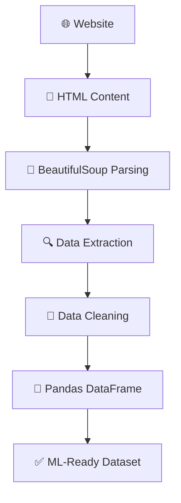

# 🌐 Web Scraping for ML — Custom Dataset Creation Pipeline

This project demonstrates how to collect data directly from websites using web scraping and convert it into a structured, ML-ready dataset using Python. When datasets aren't available as CSV files or through APIs, web scraping is the go-to technique for building custom data pipelines from scratch.

---

## 🚀 Project Overview

This project simulates a real-world data acquisition workflow — starting from a raw webpage and ending with a clean, structured dataset ready for Machine Learning.

**Pipeline:**
```
Website → HTML Content → Parsing → Data Extraction → Cleaning → Pandas DataFrame → ML Dataset
```

**Workflow steps:**
1. Send HTTP requests to target web pages
2. Download and inspect raw HTML content
3. Parse the webpage structure to locate data
4. Extract required fields from HTML elements
5. Clean and structure the extracted data
6. Export as a Pandas DataFrame for ML use

---

## 🧠 Key Learnings

**What Web Scraping Is & When to Use It**
Web scraping is the automated extraction of data from websites. It's the right tool when datasets aren't available in CSV format and no API exists — making it essential for building custom ML datasets from publicly available information.

**APIs vs. Web Scraping**
APIs return clean, structured data directly. Web scraping, on the other hand, involves pulling data embedded inside HTML pages. Scraping is the fallback when APIs aren't available, and a core real-world data collection skill.

**How Websites Store Data**
Learned how web pages are structured using HTML tags, elements, classes, and IDs — and how target data is embedded within these elements. This understanding is key to writing effective scrapers.

**Fetching & Parsing Webpage Content**
Used Python's `requests` library to download webpage source code and `BeautifulSoup` to parse and navigate the HTML tree, identifying the exact tags and attributes that hold the required data.

**Data Cleaning & DataFrame Creation**
Raw scraped text is messy. Learned to clean extracted content and transform it into structured Pandas DataFrames, ready for analysis and ML pipelines.

**Real-World Data Acquisition**
Gained end-to-end experience in the data collection workflow that real ML projects depend on — from identifying a data source to delivering a clean, usable dataset.

---

## 🛠️ Tech Stack

- Python 🐍
- `requests` — Fetching webpage content
- `BeautifulSoup` — HTML parsing & data extraction
- `pandas` — Data structuring & export
- HTML — Data source format

---

## 📂 Project Workflow


## 📈 Why This Project Matters

Real ML projects don't always come with ready-made datasets. Knowing how to collect your own data is what separates practitioners who can only work in controlled environments from those who can build pipelines in the wild.

✅ Collect data when no dataset exists &nbsp; ✅ Automate data gathering &nbsp; ✅ Build custom ML datasets &nbsp; ✅ Understand real-world data pipelines
